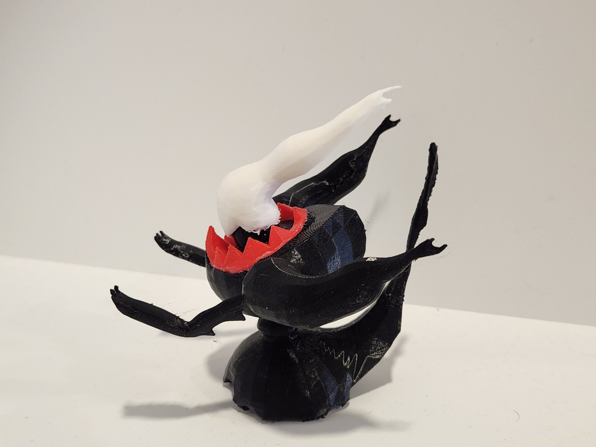

# 3D-Printable model of Darkrai pokemon

[![CC BY-SA 4.0][cc-by-sa-shield]][cc-by-sa]

Credits: [Joel Maldoando](https://sketchfab.com/maldonadosalvadorjoel)
Adapted the original [model of Darkrai](https://sketchfab.com/3d-models/darkrai-0a4f493bfcaa42579fcf00460c5334d6)

* All parts except body need to be oriented to touch buildplate with a flat surface
* Body, hands and hat need supports
* Hat is challenging to print: might need to experiment with orientation
* There are tolerances between parts, so, they might not fit tightly, and gluing might be required

## License

This work is licensed under a
[Creative Commons Attribution-ShareAlike 4.0 International License][cc-by-sa].

[![CC BY-SA 4.0][cc-by-sa-image]][cc-by-sa]

[cc-by-sa]: http://creativecommons.org/licenses/by-sa/4.0/
[cc-by-sa-image]: https://licensebuttons.net/l/by-sa/4.0/88x31.png
[cc-by-sa-shield]: https://img.shields.io/badge/License-CC%20BY--SA%204.0-lightgrey.svg
